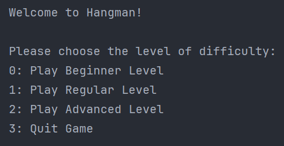
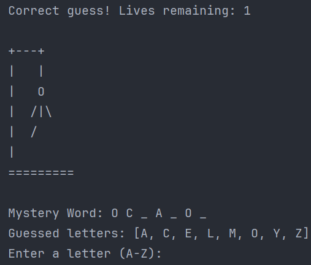

# Hangman Game

## Overview

This project is a console-based Hangman game implemented in Java. It offers a simple yet engaging gameplay experience
with a visual representation of gallows depending on the player's remaining lives. The game features three levels of
difficulty.

## Features

- **Visual Gallows**: Displays the gallows graphically in the console, changing as the player loses lives.
- **Three Levels of Difficulty**:
    - **Beginner Level**: Words up to 6 letters with 8 lives.
    - **Regular Level**: 7-8 letter words with 6 lives.
    - **Advanced Level**: Words with 9 or more characters and 3 lives.
- **Interactive Player Commands**: Allows players to choose the level of difficulty and input their guesses.

  &nbsp&nbsp&nbsp&nbsp&nbsp
  

## How to Run

Make sure you have Java installed on your system. To run the Hangman game:

1. Build the project with Maven or your IDE's build functionality.
2. Execute the `Main` class located in the `org.hangman` package.

## Gameplay

1. Upon start, player is greeted with a welcome message and prompted to choose a difficulty level.
2. The player inputs their guess one letter at a time.
3. The game provides feedback on each guess and updates the gallows display accordingly.
4. The game ends either when the player successfully guesses the word or loses all their lives.

## Testing

The project includes unit tests for critical components to ensure reliability and accuracy. Key game logic classes, such as `HandleGuess` and `GameState`, are tested to maintain the integrity of the game mechanics.

## Future Enhancements

- Addition of more words and hints for each difficulty level.
- Further expansion of unit tests to cover additional components of the game.

## Contact

For any additional questions or comments, feel free to reach out to me directly through the contact information provided
on the website.